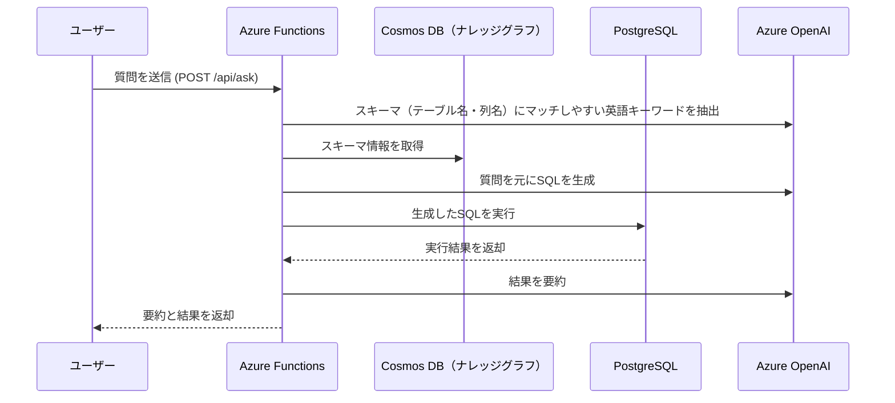

# Graph RAG + Text-to-SQL + Azure Functions (C#/.NET 8)

このプロジェクトは **自然言語質問 → SQL生成 → PostgreSQL実行 → 結果要約** を行う POC です。  
Graph RAG でスキーマを Cosmos DB に保存し、Semantic Kernel を利用して LLM から SQL と要約を生成します。

---

## 構成

- **Azure Functions (Isolated, .NET 8, C#)**
- **Semantic Kernel**（Azure OpenAI Chat Completion を利用）
- **PostgreSQL**（サンプル EC サイトスキーマ）
- **Cosmos DB (NoSQL)**: ナレッジグラフ永続化
- **Docker Compose**: PostgreSQL 起動

---

## 処理のシーケンス

以下は、自然言語質問からSQL生成、実行、結果要約までの処理フローを示したシーケンス図です。



---

## ディレクトリ構成

```

GraphRagText2Sql/
├─ src/                  # Azure Functions アプリ
│  ├─ Functions/         # HTTP エンドポイント (ask, seed, health)
│  ├─ Services/          # Cosmos/SQL/LLM サービス
│  ├─ Models/            # リクエスト/レスポンス定義
│  ├─ Prompts/           # LLM 用プロンプト
│  ├─ Program.cs         # DI 設定
│  └─ FunctionApp.csproj
├─ infra/
│  ├─ docker-compose.yml # PostgreSQL 起動
│  └─ initdb/01_ecommerce.sql # スキーマ+サンプルデータ
└─ README.md

```

---

## 前提

- [.NET 8 SDK](https://dotnet.microsoft.com/download)
- [Azure Functions Core Tools v4](https://learn.microsoft.com/azure/azure-functions/functions-run-local)
- [Docker Desktop](https://www.docker.com/products/docker-desktop)
- VSCode 拡張: C# Dev Kit / Azure Functions

---

## セットアップ手順

### 1. PostgreSQL 起動

```bash
cd infra
docker compose up -d
```

→ コンテナ起動後、自動的に `ecommerce` スキーマとサンプルデータが投入されます。

### 2. パッケージ復元とビルド

```bash
cd ../src
dotnet restore
dotnet build
```

### 3. ローカル実行

```bash
func start
```

起動後、以下のエンドポイントが利用可能になります。

* `POST /api/seed` – Graph RAG にスキーマ投入
* `POST /api/ask` – 質問 → SQL → 実行 → 要約
* `GET /api/health` – ヘルスチェック

---

## 利用方法

### 1. スキーマを Cosmos に投入

```bash
curl -X POST http://localhost:7071/api/seed
```

### 2. 正常動作確認

```bash
curl http://localhost:7071/api/health
# => ok
```

### 3. 自然言語で質問

```bash
curl -s -X POST http://localhost:7071/api/ask \
  -H "Content-Type: application/json" \
  -d '{
    "Question": "直近30日で売上が多い上位5日の合計金額と注文数を教えて"
  }' | jq
```

**返却例**

```json
{
  "sql": "SELECT order_date, orders, gross_sales FROM ecommerce.v_sales_daily ...",
  "rows": [
    { "order_date": "2025-09-05", "orders": 3, "gross_sales": 15378.00 }
  ],
  "summary": "直近30日で最も売上が多い日は 9月5日で、総額は 15,378 円、注文数は3件でした。",
  "contextTables": [ "ecommerce.v_sales_daily" ]
}
```

---

## 設定

`src/appsettings.json` または環境変数で指定します。

```json
"OpenAI": {
  "Endpoint": "https://<your-aoai>.openai.azure.com/",
  "ApiKey": "<your-aoai-key>",
  "Deployment": "gpt-4o-mini"
},
"Cosmos": {
  "Endpoint": "https://<your-cosmos>.documents.azure.com:443/",
  "Key": "<your-cosmos-key>",
  "Database": "graphdb",
  "Container": "graph"
},
"Postgres": {
  "ConnectionString": "Host=localhost;Port=5432;Username=app;Password=app_pw;Database=appdb"
}
```

---

## デバッグ（VSCode）

* VSCode で「Run and Debug → .NET Functions」を選択
* `F5` 実行でブレークポイントが利用可能

---

## デプロイ (Azure)

```bash
func azure functionapp publish <your-functionapp-name>
```

---

## 注意点

* 本POCは読み取り系SQLを前提としています。実運用では必ず SQL Injection ガードや権限管理を導入してください。
* Cosmos の Graph 検索はキーワードマッチです。高度な検索には Vector Search や Gremlin API を検討可能です。

---

## ライセンス

MIT License
