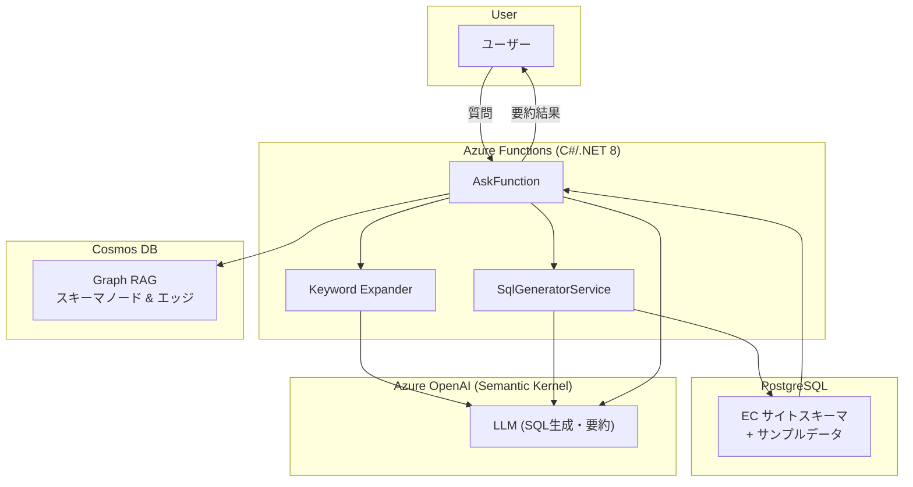
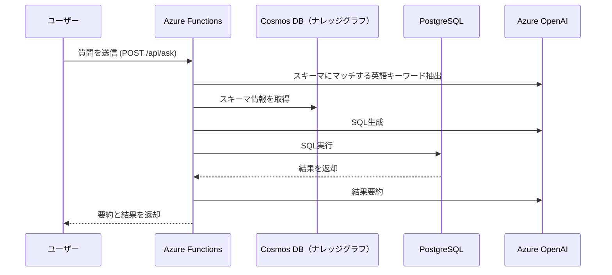
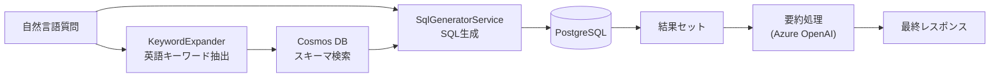
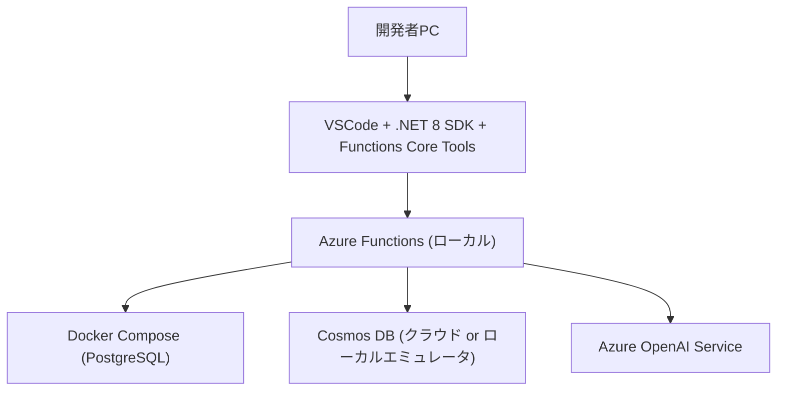

# Graph RAG + Text-to-SQL + Azure Functions (C#/.NET 8)

このプロジェクトは **自然言語質問 → SQL生成 → PostgreSQL実行 → 結果要約** を行う POC です。
Graph RAG でスキーマを Cosmos DB に保存し、Semantic Kernel を利用して LLM から SQL と要約を生成します。


---

## 1. プロジェクト概要

* **目的**: 自然言語から SQL を自動生成し、データベースに実行して結果を要約する仕組みを検証する。
* **利用技術**:

  * Graph RAG（スキーマ永続化 in Cosmos DB）
  * Semantic Kernel（Azure OpenAI Chat Completion）
  * Azure Functions (C#/.NET 8, Isolated)
  * PostgreSQL（EC サイトサンプルスキーマ）

---

## 2. 全体アーキテクチャ

### アーキテクチャ図



---

## 3. 処理フロー

### シーケンス図



### データの流れ（Data Flow）



---

## 4. 開発環境構成

### 開発環境図



### 必要ツール

* [.NET 8 SDK](https://dotnet.microsoft.com/download)
* [Azure Functions Core Tools v4](https://learn.microsoft.com/azure/azure-functions/functions-run-local)
* [Docker Desktop](https://www.docker.com/products/docker-desktop)
* VSCode 拡張: C# Dev Kit / Azure Functions

### ディレクトリ構成

```
GraphRagText2Sql/
├─ src/                  # Azure Functions アプリ
│  ├─ Functions/         # HTTP エンドポイント (ask, seed, health)
│  ├─ Services/          # Cosmos/SQL/LLM サービス
│  ├─ Models/            # リクエスト/レスポンス定義
│  ├─ Prompts/           # LLM 用プロンプト
│  ├─ Program.cs         # DI 設定
│  └─ FunctionApp.csproj
├─ infra/
│  ├─ docker-compose.yml # PostgreSQL 起動
│  └─ initdb/01_ecommerce.sql # スキーマ+サンプルデータ
└─ README.md
```

---

## 5. セットアップ手順

1. **PostgreSQL 起動**

```bash
cd infra
docker compose up -d
```

→ 自動で `ecommerce` スキーマとサンプルデータ投入。

2. **パッケージ復元とビルド**

```bash
cd ../src
dotnet restore
dotnet build
```

3. **ローカル実行**

```bash
func start
```

利用可能なエンドポイント:

* `POST /api/seed` – Graph RAG にスキーマ投入
* `POST /api/ask` – 質問 → SQL → 実行 → 要約
* `GET /api/health` – ヘルスチェック

---

## 6. 利用方法

### スキーマ投入

```bash
curl -X POST http://localhost:7071/api/seed
```

### 動作確認

```bash
curl http://localhost:7071/api/health
# => ok
```

### 自然言語で質問

```bash
curl -s -X POST http://localhost:7071/api/ask \
  -H "Content-Type: application/json" \
  -d '{
    "Question": "直近30日で売上が多い上位5日の合計金額と注文数を教えて"
  }' | jq
```

**返却例**

```json
{
  "sql": "SELECT order_date, orders, gross_sales FROM ecommerce.v_sales_daily ...",
  "rows": [
    { "order_date": "2025-09-05", "orders": 3, "gross_sales": 15378.00 }
  ],
  "summary": "直近30日で最も売上が多い日は 9月5日で、総額は 15,378 円、注文数は3件でした。",
  "contextTables": [ "ecommerce.v_sales_daily" ]
}
```

---

## 7. 実装詳細

* **SchemaSeeder**: テーブル/カラムノード・外部キーエッジを Cosmos DB に登録
* **KeywordExpander**: 質問から英語キーワード抽出
* **CosmosGraphService**: スキーマとリレーションを文字列化
* **SqlGeneratorService**: LLM により SQL を生成
* **AskFunction**: 全処理を統合（質問→SQL→実行→要約）
* **Prompts**: SQL生成・要約用のプロンプトファイル

---

## 8. 設定

`src/appsettings.json` または環境変数で指定

```json
"OpenAI": { 
  "Endpoint": "...", 
  "ApiKey": "...", 
  "Deployment": "gpt-4o-mini" 
},
"Cosmos": { 
  "Endpoint": "...", 
  "Key": "...", 
  "Database": "graphdb", 
  "Container": "graph" 
},
"Postgres": { 
  "ConnectionString": "Host=localhost;Port=5432;..."
}
```

---

## 9. 開発補助

* VSCode デバッグ: 「Run and Debug → .NET Functions」
* Azure デプロイ:

```bash
func azure functionapp publish <your-functionapp-name>
```

---

## 10. 注意点

* 読み取り系 SQL 前提 → **SQL Injection 対策必須**
* Cosmos Graph 検索はキーワードマッチのみ → Vector Search / Gremlin API を検討可能
* 本リポジトリは **社内レビュー用サンプル** であり、**実運用前提ではありません**。

---

## 11. ライセンス

MIT License
